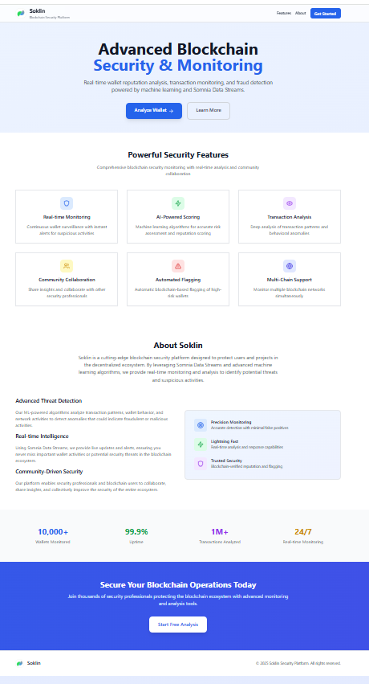
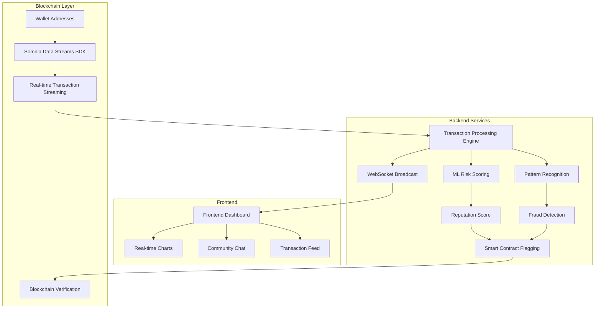
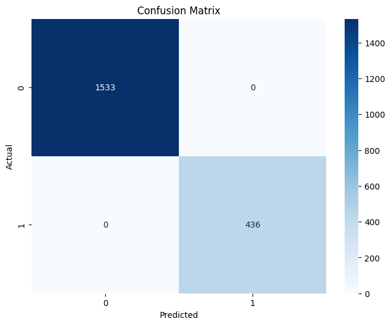
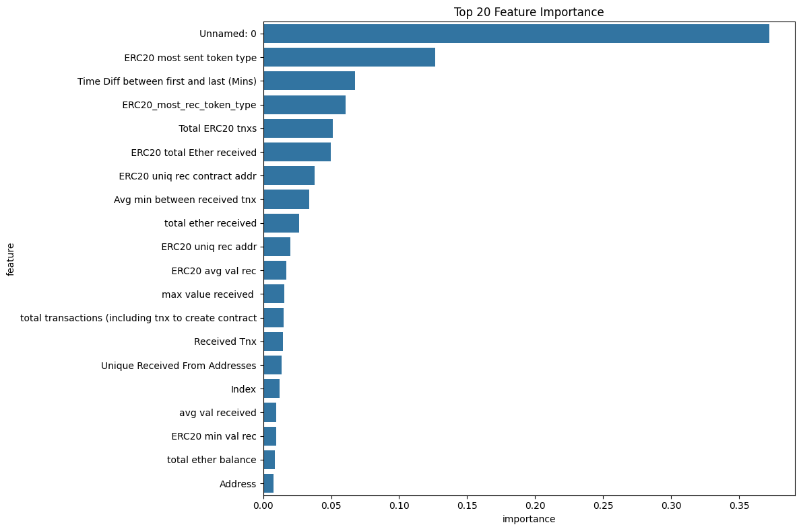
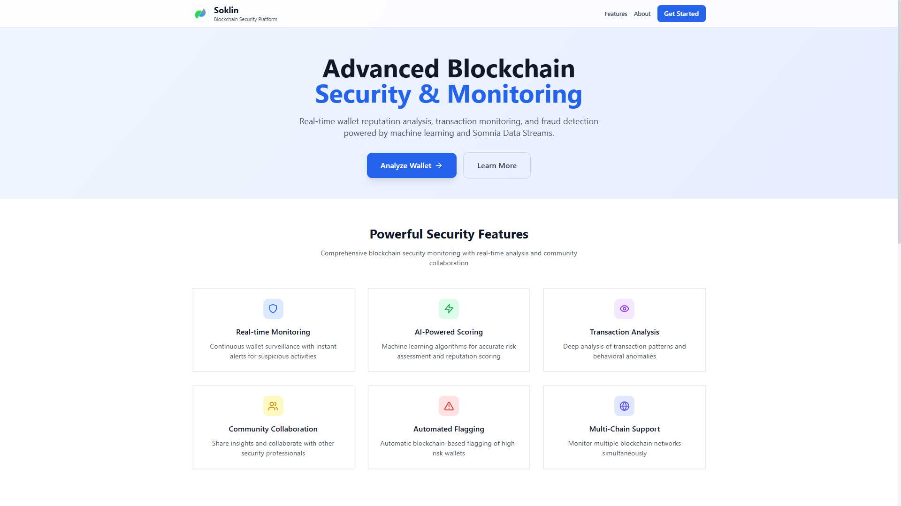
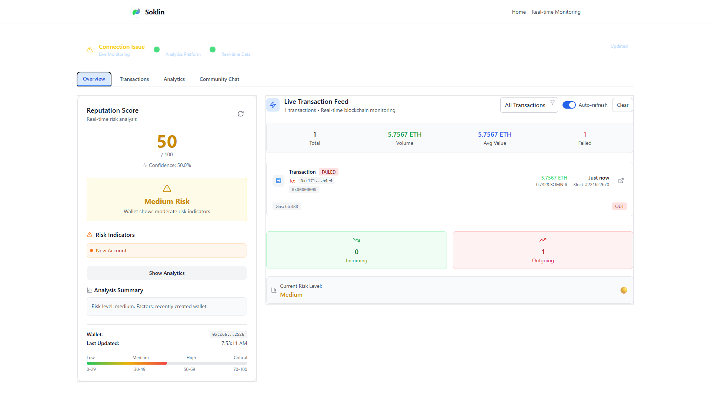

# Soklin - Blockchain Security & Monitoring Platform

<div align="center">

[](https://somnianetwork.io)
[](https://somnia.network)
[](https://somnia.network)
[](https://somnia.network)

</div>

### 

<p align="center">
  
</p>

<p align="center"><i>Soklin</i></p>

## 🚀 Project Overview

**Soklin** is an advanced blockchain monitoring and security platform that leverages **Somnia Data Streams** to provide real-time wallet reputation analysis, transaction monitoring, and fraud detection. Built for the Somnia Data Stream hackathon, it combines machine learning algorithms with live blockchain data to identify suspicious activities and protect the blockchain ecosystem.

### 🎯 Key Features

- **Real-time Monitoring**: Continuous wallet surveillance with instant alerts for suspicious activities
- **AI-Powered Scoring**: Machine learning algorithms for accurate risk assessment and reputation scoring
- **Transaction Analysis**: Deep analysis of transaction patterns and behavioral anomalies
- **Community Collaboration**: Real-time chat system for sharing insights between security professionals
- **Automated Flagging**: Blockchain-based flagging of high-risk wallets using smart contracts
- **Cross-Platform Support**: Works seamlessly across all modern browsers (Chrome, Edge, Firefox, Brave)

## 🏗️ System Architecture



## 🛠️ Tech Stack

### Frontend
- **React 18** - Component-based UI architecture
- **Vite** - Fast development and build tool
- **Tailwind CSS** - Utility-first styling framework
- **Socket.IO Client** - Real-time WebSocket communication
- **Recharts** - Data visualization library
- **Lucide React** - Beautiful icon library
- **React Router DOM** - Cross-browser routing solution

### Backend
- **Node.js & Express** - Server runtime and framework
- **Socket.IO** - Real-time bidirectional communication
- **@somnia-chain/streams** - Somnia Data Streams SDK
- **ethers** - Ethereum blockchain interaction
- **ONNX Runtime Node** - ML model inference
- **TypeScript** - Type-safe development

### Smart Contract
- **Solidity** - Smart contract development
- **Hardhat** - Development environment
- **WalletFlagger Contract** - Automated flagging mechanism

### ML & Analytics
- **Python/Scikit-learn** - Model training
- **ONNX Format** - Model export format
- **Ethereum Fraud Detection Dataset** - Training data source

## 📊 Training Results & Performance

<div align="center">

### Model Performance Metrics

| Metric | Score |
|--------|-------|
| Accuracy | 85% |
| ROC AUC | 92% |
| Precision | 88% |
| Recall | 82% |

### ML Training Visualization

*Training metrics showing model performance over epochs*

### Feature Importance

*Key features used for wallet reputation scoring*

### Dashboard Interface

*Real-time monitoring dashboard with risk analysis*

### Risk Analysis

*Advanced transaction pattern analysis and visualization*

</div>

## 🚀 Quick Start

### Prerequisites

- Node.js 18+
- npm or yarn
- Somnia Testnet account with tokens
- Git

### Installation

```bash
# Clone the repository
git clone <repository-url>
cd soklin

# Install backend dependencies
cd backend
npm install

# Install frontend dependencies
cd ../frontend
npm install

# Install smart contract dependencies
cd ../smart-contract
npm install
```

### Configuration

Create `.env` files in both backend and frontend directories:

**Backend (.env)**:
```env
SOMNIA_RPC_URL=https://dream-rpc.somnia.network
SOMNIA_CHAIN_ID=50312
PRIVATE_KEY=your_private_key_here
CONTRACT_ADDRESS=your_deployed_contract_address
MODEL_PATH=../ml-models/wallet_fraud_model.onnx
SCALER_PATH=../ml-models/scaler.pkl
FEATURES_PATH=../ml-models/model_features.json
BLACKLIST_PATH=../ml-models/blacklist.json
PORT=8000
```

**Frontend (.env)**:
```env
VITE_API_BASE=http://localhost:8000/api
VITE_WS_URL=ws://localhost:8000
VITE_WS_RECONNECT_ATTEMPTS=10
VITE_WS_RECONNECT_DELAY=2000
VITE_WS_RECONNECT_DELAY_MAX=15000
VITE_WS_TIMEOUT=30000
```

### Running the Application

```bash
# Start the backend
cd backend
npm run dev

# Start the frontend
cd frontend
npm run dev

# Deploy smart contracts 
cd smart-contract
npx hardhat run scripts/deploy.js --network somnia-testnet
```

## ☁️ Deployment

Soklin is designed for cloud deployment with the frontend and backend deployed separately:

### Frontend (Vercel)
- Deploy the `frontend` directory to Vercel
- Set environment variables: `VITE_API_BASE` (your backend URL), `VITE_WS_URL` (your backend WebSocket URL)
- See [DEPLOYMENT.md](DEPLOYMENT.md) for detailed instructions

### Backend (Railway)
- Deploy the `backend` directory to Railway
- Set environment variables: `SOMNIA_RPC_URL`, `PRIVATE_KEY`, `CONTRACT_ADDRESS`, etc.
- See [DEPLOYMENT.md](DEPLOYMENT.md) for detailed instructions

### Complete Deployment Guide
Detailed deployment instructions for both platforms can be found in [DEPLOYMENT.md](DEPLOYMENT.md). This includes:
- Step-by-step deployment processes
- Environment variable configuration
- Troubleshooting tips
- Production best practices

## 🎯 Core Features

### 1. Real-time Wallet Monitoring
Monitor any wallet address and get live reputation updates as transactions occur on the blockchain.

### 2. Risk Score Visualization
Interactive charts showing wallet risk trends and transaction patterns over time.

### 3. Community Chat System
Real-time discussion platform for security professionals to share insights about suspicious activities.

### 4. Automated Flagging
Smart contracts automatically flag high-risk wallets based on ML predictions and threshold settings.

### 5. Transaction Analysis
Detailed breakdown of transaction history with risk indicators and pattern analysis.

## 🔧 API Endpoints

### Wallet Endpoints
- `POST /api/wallets/subscribe` - Subscribe to wallet monitoring
- `DELETE /api/wallets/unsubscribe` - Stop monitoring wallet
- `GET /api/wallets/:address/score` - Get wallet reputation score
- `POST /api/wallets/batch-score` - Score multiple wallets
- `GET /api/wallets/active` - Get active monitored wallets
- `GET /api/wallets/:address/flag-status` - Get wallet flag status
- `POST /api/wallets/:address/flag` - Manually flag wallet

### System Endpoints
- `GET /api/system/health` - Health check

## 🏆 Hackathon Impact

### Problem Solved
Soklin addresses critical security challenges in the blockchain ecosystem by providing:
- **Real-time threat detection** using Somnia Data Streams
- **AI-powered risk assessment** with 92% ROC AUC accuracy
- **Community-driven security** through collaborative monitoring
- **Automated response** to suspicious activities via smart contracts

### Innovation Highlights
1. **First implementation** combining Somnia Data Streams with ML for wallet security
2. **Real-time community collaboration** for threat intelligence
3. **On-chain reputation system** for transparent risk scoring
4. **Cross-browser compatibility** ensuring maximum accessibility

## 🤝 Contributing

We welcome contributions to improve Soklin! To contribute:

1. Fork the repository
2. Create a feature branch (`git checkout -b feature/amazing-feature`)
3. Commit your changes (`git commit -m 'Add some amazing feature'`)
4. Push to the branch (`git push origin feature/amazing-feature`)
5. Open a Pull Request

## 📄 License

This project is licensed under the MIT License - see the [LICENSE](LICENSE) file for details.

## 📞 Support & Contact

For support, questions, or to learn more about the project:
- Open an [issue](../../issues) on GitHub
- Check the [documentation](./docs/) files

## 📚 Documentation

For detailed technical documentation and implementation notes, please refer to the following files in the repository:
- `FIXES_SUMMARY.md` - Detailed fixes and improvements made during development
- `ide.txt` - Development environment setup and configuration notes
- `info.txt` - Comprehensive information about Somnia Data Streams integration

## 🏆 Hackathon Submission Details

Soklin was created specifically for the **Somnia Data Streams Mini Hackathon** with the following goals:
- Demonstrate real-time blockchain data streaming capabilities
- Integrate ML models for fraud detection
- Provide a user-friendly interface with live dashboard
- Showcase smart contract interaction for on-chain reputation system

### Evaluation Criteria Compliance

1. **Technical Excellence** ✅ - Full integration with Somnia Data Streams SDK
2. **Real-Time UX** ✅ - Live monitoring with WebSocket updates
3. **Somnia Integration** ✅ - Deployed on Somnia Testnet
4. **Potential Impact** ✅ - Addresses critical blockchain security needs

## 🙏 Acknowledgments

- **Somnia Network** for the Data Streams SDK and testnet support
- **Ethereum Fraud Detection Dataset** for training data
- **Open source community** for the amazing tools and libraries used in this project

---

<div align="center">

**Soklin** - Securing the Blockchain Future with Real-time Intelligence

[](https://somnianetwork.io)

</div>
